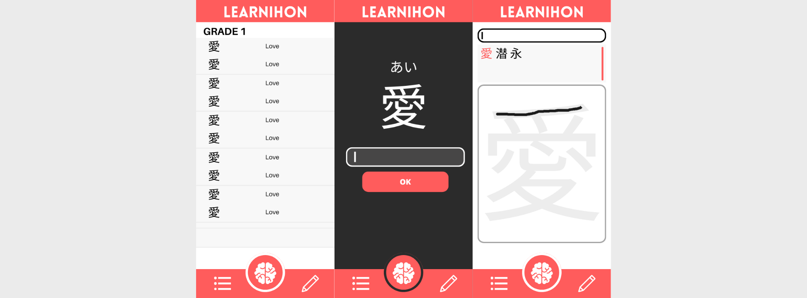
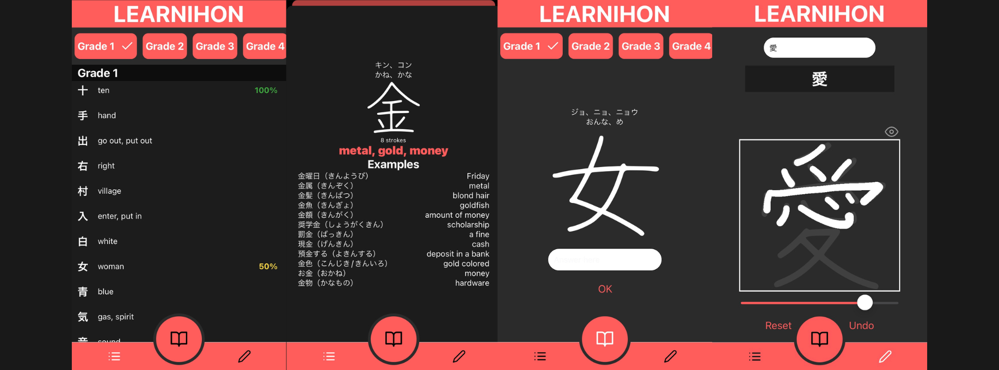

---

 

---

## Deploiement
- [x] &nbsp; 
- [x] &nbsp; 

**Nom de l'application** : Learnihon

**Contexte** : En plus de 92 caractères composants les deux syllabaires japonais, le Japon possède également plus de 2000 idéogrammes appelés "kanjis" issus du chinois et utilisés a quotidien dans la langue. Learnihon a pour but d'aider à l'apprentissage de ces caractères en proposant un système de "flashcard" aléatoire, pouvant être trié par niveaux. L'application propose ainsi une liste détaillée des différents caractères ainsi qu'un espace pour s'entrainer à l'écriture des kanjis. L'application est entièrement en anglais et utilise l'API web [Kanji alive](https://app.kanjialive.com/api/docs).

**Visuels** : 

*Maquettes de l'application :*

*Captures d'écran de l'application :*

**Fonctionnement** : 

Learnihon possède trois onglets principaux : 
- **Liste** : La liste de tous les kanjis disponibles, triés par niveaux. Il est possible d'afficher seulement les niveaux que l'on souhaite. En appuyant sur un kanji, une page s'affiche comprenant tous les détails sur le symbole. Cela inclut ses différentes prononciations, le tracé du caractère, les sens du mot en anglais, le radical du symbole s'il y en a un ainsi que divers exemples.

- **Apprentissage** : Ici, des kanjis aléatoires apparaîtront. Le but est de traduire ces kanjis et de voir si l'on a eu juste ou non. 
Il est possible de sélectionner seulement les niveaux que l'on désire apprendre. Les résultats sont sauvegardés en local et s'affichent dans l'onglet *liste* sous forme de pourcentage.

- **Dojo** : Cet onglet permet de s'entraîner à l'écriture des différents caractères. L'onglet possède une zone de recherche ainsi qu'une zone de recherche. Il est possible de rechercher des kanjis selon divers critères et d'en sélectionner un, sa silhouette apparaîtra alors dans la zone de dessin. Il est possible de masquer et de démasquer la silhouette du caractère à tout moment. Le principe est donc de masquer le caractère afin de le tracer de mémoire, puis de révéler la silhouette dans le but de voir si l'on a eu juste ou non.

L'application se base sur les paramètres de l'appareil afin de s'afficher en mode clair ou en mode sombre.

 

arthur.valin@etu.uca.fr

© PM2

